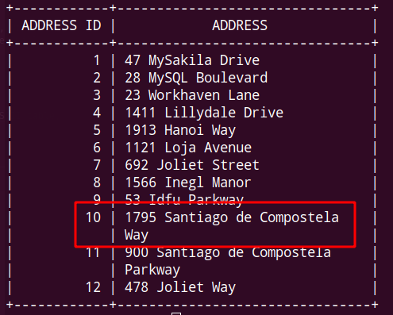
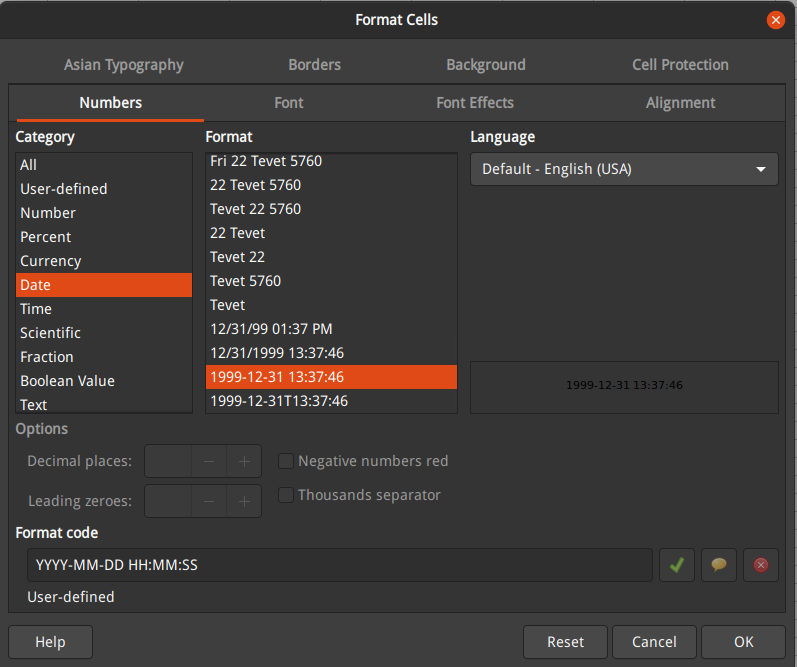
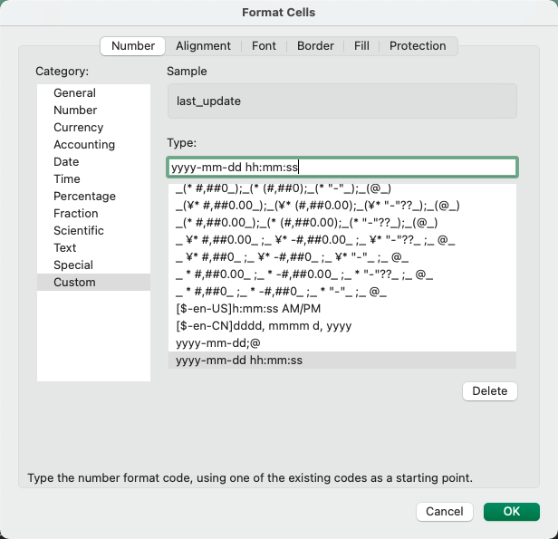

# FAQ

## go get package timeout

Error message

```txt
package golang.org/x/sys: unrecognized import path "golang.org/x/sys": https fetch: Get "https://golang.org/x/sys?go-get=1": dial tcp 216.239.37.1:443: i/o timeout
```

Fix method 1:

```bash
mkdir -p $GOPATH/github.com/golang && cd $GOPATH/github.com/golang
git clone https://github.com/golang/sys
ln -s $GOPATH/github.com/golang $GOPATH/golang.org/x
```

Fix method 2:

Mac or Linux

```bash
go env -w GOPROXY="https://goproxy.cn,https://goproxy.io,direct"
```

Windows


## panic: pq: unknown response for startup: 'J'

d18n use https://github.com/lib/pq library connect PostgreSQL, if connecting to a non-postgres server, will give this error, please check `--port` flag first.

also see: https://github.com/lib/pq/issues/505

## bufio.Scanner: token too long

d18n use bufio read file chunk by chunk, default MaxScanTokenSize if 64KB, you can change chunk size with `--max-buffer-size` flag. Notice use a large buffer will use more memory.

## ASCII table line wrap

d18n use `github.com/olekukonko/tablewriter` library to print result as ASCII table, some times a long value will be auto printed in multi-lines, even if there is no line-feed in value.



## fatal error: runtime: cannot allocate memory

```txt
fatal error: runtime: cannot allocate memory

runtime stack:
runtime.throw(0x19edab9, 0x1f)
        runtime/panic.go:1117 +0x72
runtime.persistentalloc1(0x1018, 0x40, 0x3450d98, 0x7fb138160570)
        runtime/malloc.go:1360 +0x2d1
runtime.persistentalloc.func1()
        runtime/malloc.go:1314 +0x45
runtime.systemstack(0x46d614)
        runtime/asm_amd64.s:379 +0x66
runtime.mstart()
        runtime/proc.go:1246
```

Please check `ulimit -a` first, if system has resource limit. Following is develop environment info.

```bash
~ $ ulimit -a
core file size          (blocks, -c) 0
data seg size           (kbytes, -d) unlimited
scheduling priority             (-e) 0
file size               (blocks, -f) unlimited
pending signals                 (-i) 63308
max locked memory       (kbytes, -l) 65536
max memory size         (kbytes, -m) unlimited
open files                      (-n) 1024
pipe size            (512 bytes, -p) 8
POSIX message queues     (bytes, -q) 819200
real-time priority              (-r) 0
stack size              (kbytes, -s) 8192
cpu time               (seconds, -t) unlimited
max user processes              (-u) 63308
virtual memory          (kbytes, -v) unlimited
file locks                      (-x) unlimited
```

Resource limit is a protection for your system. Check your data, if there are large columns. Check your corpus, if there is a large dictionary. Do not increase resource limit value, if you surely know what you are doing.

## Excel import time values error

```txt
line: 2, error: Error 1292: Incorrect datetime value: '02/15/2006 04:34:32' for column 'last_update' at row 1
```

If Excel file has a different time format from MySQL will show this error. Change cell format will fix this error.

OpenOffice Format Cells config example



MS Office Format Cells config example



Use `DateFormat` masking function covert date time.

```txt
last_update,DateFormat,"MM/DD/YYYY HH:mm:ss"
```

```bash
~ $ d18n --defaults-extra-file test/my.cnf --file actor.xlsx --mask test/mask.csv --import --database sakila --table actor --replace --disable-foreign-key-checks
```

# ORA-01009: missing mandatory parameter

With follow command will raise this error, because you don't specified `--query` or `-q` flag.

```bash
./d18n --server oracle --host 127.0.0.1 --port 1521 --user sys --database xe -p
```

Do like this will fix the problem.

```bash
./d18n --server oracle --host 127.0.0.1 --port 1521 --user sys --database xe -p -q

./d18n --server oracle --host 127.0.0.1 --port 1521 --user sys --database xe -p --query 'select 1 from dual'
```

# Oracle NUMBER Format

Ref: https://www.anycodings.com/1questions/204281/oracle-floating-point-comparison
