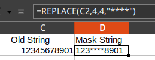
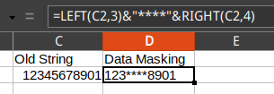
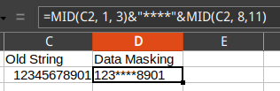

# Tips

## Excel desensitization

Excel has many useful functions, you can desensitize data with built-in function.

e.g., `=REPLACE(C2,4,4,"****")`.



e.g., `=LEFT(C2,3)&"****"&RIGHT(C2,4)`.



e.g. `=MID(C2, 0, 3)`



## MySQL SELECT INTO OUTFILE

MySQL support `SELECT INTO OUTFILE` syntax. But this is not full data type compatible.

```sql
SELECT id,
   client,
   project,
   task,
   description,
   time,
   date
  INTO OUTFILE '/path/to/file.csv'
  FIELDS TERMINATED BY ',' OPTIONALLY ENCLOSED BY '"'
  LINES TERMINATED BY '\n'
  FROM ts
```

Ref: https://stackoverflow.com/questions/1119312/mysql-export-into-outfile-csv-escaping-chars

## MySQL LOAD DATA Syntax

Load data from files into tables, MySQL support `LOAD DATA` syntax. But the file must be strictly formatted.

e.g. csv file

```sql
LOAD DATA INFILE 'country.csv'
INTO TABLE country
FIELDS TERMINATED BY ','
ENCLOSED BY '"'
LINES TERMINATED BY '\n'
IGNORE 1 ROWS
(field_1, field_2, field_3);
```

Ref: https://stackoverflow.com/questions/3635166/how-do-i-import-csv-file-into-a-mysql-table
